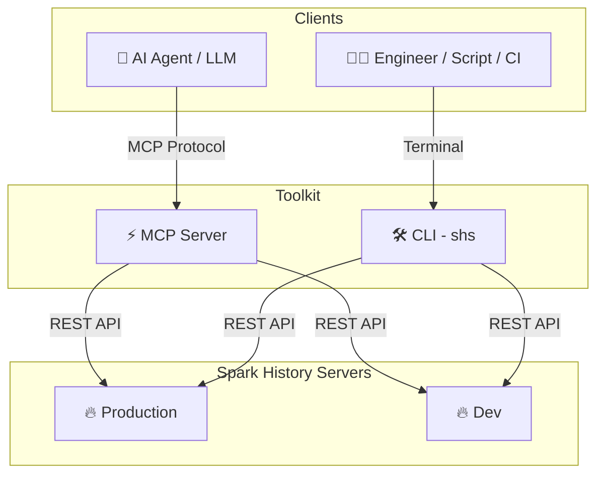

# Kubeflow Spark AI Toolkit

[](https://github.com/kubeflow/mcp-apache-spark-history-server/actions)
[](https://www.python.org/downloads/)
[](https://modelcontextprotocol.io/)
[](https://opensource.org/licenses/Apache-2.0)
[](https://github.com/kubeflow)
[](https://cloud-native.slack.com/archives/C09FRRM6QM7)

> **🤖 Connect AI agents and engineers to Apache Spark History Server for intelligent job analysis, performance monitoring, and terminal-based investigation**

This project provides two interfaces to your Apache Spark History Server data — an **MCP server** for AI agents doing natural-language investigation, and a **CLI (`shs`)** for engineers and scripts that need direct terminal access:

---

> [!IMPORTANT]
> ### ✨ NEW — Spark History Server CLI is now available
> [](skills/cli/README.md)
>
> A standalone Go binary that queries Spark History Server **directly from your terminal** — no MCP, no AI framework, no daemon process. Inspect jobs, compare runs, investigate failures, and script against the Spark REST API.
>
> **[Get started with the SHS CLI →](skills/cli/README.md)**

---

### This project provides two interfaces

| | ⚡ MCP Server | 🛠️ [SHS CLI (`shs`)](skills/cli/) |
|---|---|---|
| **For** | AI agents and MCP-compatible clients | Humans, shell scripts, CI/CD, coding agents |
| **How** | AI calls tools via Model Context Protocol | Direct terminal commands, no protocol overhead |
| **Example** | *"Why is my ETL job slow?"* → agent investigates | `shs stages -a APP --sort duration` |
| **Install** | `uv run -m spark_history_mcp.core.main` | `cd skills/cli && go build -o bin/shs .` |

---

## 🎯 What is This?

**Kubeflow Spark AI Toolkit** is a diagnostics toolkit for Apache Spark applications. It provides two interfaces to your Spark History Server data:

- **⚡ MCP Server** — AI agents query Spark data via the Model Context Protocol using natural language
- **🛠️ CLI (`shs`)** — Engineers and scripts query Spark data directly from the terminal

Both interfaces enable:

- 🔍 **Query job details** — application metadata, stages, executors, SQL queries
- 📊 **Analyze performance** — identify slow stages, bottlenecks, and resource usage patterns
- 🔄 **Compare runs** — diff configurations and metrics across applications to catch regressions
- 🚨 **Investigate failures** — drill into failed tasks with detailed error analysis
- 📈 **Generate insights** — surface optimization recommendations from historical execution data

📺 **See it in action:**

[](https://www.youtube.com/watch?v=e3P_2_RiUHw)


## 🏗️ Architecture



## Quick Start

### CLI (`shs`)

Download the latest binary from [GitHub Releases](https://github.com/kubeflow/mcp-apache-spark-history-server/releases):

```bash
# Linux (amd64)
curl -sSL https://github.com/kubeflow/mcp-apache-spark-history-server/releases/latest/download/shs-linux-amd64.tar.gz | tar xz
sudo mv shs /usr/local/bin/

# macOS (Apple Silicon)
curl -sSL https://github.com/kubeflow/mcp-apache-spark-history-server/releases/latest/download/shs-darwin-arm64.tar.gz | tar xz
sudo mv shs /usr/local/bin/
```

Point it at your Spark History Server and start querying:

```bash
shs apps --server http://your-spark-history-server:18080
shs stages -a <app-id> --sort duration
```

See the [CLI documentation](skills/cli/README.md) for full usage.

### MCP Server

```bash
# Run directly with uvx (no install needed)
uvx --from mcp-apache-spark-history-server spark-mcp

# Or install with pip
pip install mcp-apache-spark-history-server
python3 -m spark_history_mcp.core.main
```

The package is published to [PyPI](https://pypi.org/project/mcp-apache-spark-history-server/).

### Prerequisites
- Existing Spark History Server (running and accessible)
- **CLI**: No dependencies — single static binary
- **MCP Server**: Python 3.12+, [uv](https://docs.astral.sh/uv/getting-started/installation/)

### ⚙️ Server Configuration
Edit `config.yaml` for your Spark History Server:

**Config File Options:**
- Command line: `--config /path/to/config.yaml` or `-c /path/to/config.yaml`
- Environment variable: `SHS_MCP_CONFIG=/path/to/config.yaml`
- Default: `./config.yaml`
```yaml
servers:
  local:
    default: true
    url: "http://your-spark-history-server:18080"
    auth:  # optional
      username: "user"
      password: "pass"
    include_plan_description: false  # optional, whether to include SQL execution plans by default (default: false)
mcp:
  transports:
    - streamable-http # streamable-http or stdio.
  port: "18888"
  debug: true
```


### 📊 Sample Data
The repository includes real Spark event logs for testing:
- `spark-bcec39f6201b42b9925124595baad260` - ✅ Successful ETL job
- `spark-110be3a8424d4a2789cb88134418217b` - 🔄 Data processing job
- `spark-cc4d115f011443d787f03a71a476a745` - 📈 Multi-stage analytics job

See **[TESTING.md](TESTING.md)** for using them.

## 📸 Screenshots

### 🔍 Get Spark Application


### ⚡ Job Performance Comparison


## 🛠️ MCP Tools

> **Note**: These tools are subject to change as we scale and improve the performance of the MCP server.

The MCP server provides **18 specialized tools** organized by analysis patterns. LLMs can intelligently select and combine these tools based on user queries:

### 📊 Application Information
*Basic application metadata and overview*
| 🔧 Tool | 📝 Description |
|---------|----------------|
| `list_applications` | 📋 Get a list of all applications available on the Spark History Server with optional filtering by status, date ranges, and limits |
| `get_application` | 📊 Get detailed information about a specific Spark application including status, resource usage, duration, and attempt details |

### 🔗 Job Analysis
*Job-level performance analysis and identification*
| 🔧 Tool | 📝 Description |
|---------|----------------|
| `list_jobs` | 🔗 Get a list of all jobs for a Spark application with optional status filtering |
| `list_slowest_jobs` | ⏱️ Get the N slowest jobs for a Spark application (excludes running jobs by default) |

### ⚡ Stage Analysis
*Stage-level performance deep dive and task metrics*
| 🔧 Tool | 📝 Description |
|---------|----------------|
| `list_stages` | ⚡ Get a list of all stages for a Spark application with optional status filtering and summaries |
| `list_slowest_stages` | 🐌 Get the N slowest stages for a Spark application (excludes running stages by default) |
| `get_stage` | 🎯 Get information about a specific stage with optional attempt ID and summary metrics |
| `get_stage_task_summary` | 📊 Get statistical distributions of task metrics for a specific stage (execution times, memory usage, I/O metrics) |

### 🖥️ Executor & Resource Analysis
*Resource utilization, executor performance, and allocation tracking*
| 🔧 Tool | 📝 Description |
|---------|----------------|
| `list_executors` | 🖥️ Get executor information with optional inactive executor inclusion |
| `get_executor` | 🔍 Get information about a specific executor including resource allocation, task statistics, and performance metrics |
| `get_executor_summary` | 📈 Aggregates metrics across all executors (memory usage, disk usage, task counts, performance metrics) |
| `get_resource_usage_timeline` | 📅 Get chronological view of resource allocation and usage patterns including executor additions/removals |

### ⚙️ Configuration & Environment
*Spark configuration, environment variables, and runtime settings*
| 🔧 Tool | 📝 Description |
|---------|----------------|
| `get_environment` | ⚙️ Get comprehensive Spark runtime configuration including JVM info, Spark properties, system properties, and classpath |

### 🔎 SQL & Query Analysis
*SQL performance analysis and execution plan comparison*
| 🔧 Tool | 📝 Description |
|---------|----------------|
| `list_slowest_sql_queries` | 🐌 Get the top N slowest SQL queries for an application with detailed execution metrics and optional plan descriptions |
| `compare_sql_execution_plans` | 🔍 Compare SQL execution plans between two Spark jobs, analyzing logical/physical plans and execution metrics |

### 🚨 Performance & Bottleneck Analysis
*Intelligent bottleneck identification and performance recommendations*
| 🔧 Tool | 📝 Description |
|---------|----------------|
| `get_job_bottlenecks` | 🚨 Identify performance bottlenecks by analyzing stages, tasks, and executors with actionable recommendations |

### 🔄 Comparative Analysis
*Cross-application comparison for regression detection and optimization*
| 🔧 Tool | 📝 Description |
|---------|----------------|
| `compare_job_environments` | ⚙️ Compare Spark environment configurations between two jobs to identify differences in properties and settings |
| `compare_job_performance` | 📈 Compare performance metrics between two Spark jobs including execution times, resource usage, and task distribution |

### 🤖 How LLMs Use These Tools

**Query Pattern Examples:**
- *"Show me all applications between 12 AM and 1 AM on 2025-06-27"* → `list_applications`
- *"Why is my job slow?"* → `get_job_bottlenecks` + `list_slowest_stages` + `get_executor_summary`
- *"Compare today vs yesterday"* → `compare_job_performance` + `compare_job_environments`
- *"What's wrong with stage 5?"* → `get_stage` + `get_stage_task_summary`
- *"Show me resource usage over time"* → `get_resource_usage_timeline` + `get_executor_summary`
- *"Find my slowest SQL queries"* → `list_slowest_sql_queries` + `compare_sql_execution_plans`

## 📔 AWS Integration Guides

If you are an existing AWS user looking to analyze your Spark Applications, we provide detailed setup guides for:

- **[AWS Glue Users](examples/aws/glue/README.md)** - Connect to Glue Spark History Server
- **[Amazon EMR Users](examples/aws/emr/README.md)** - Use EMR Persistent UI for Spark analysis

These guides provide step-by-step instructions for setting up the Spark History Server MCP with your AWS services.

## 🚀 Kubernetes Deployment

Deploy using Kubernetes with Helm:

> ⚠️ **Work in Progress**: We are still testing and will soon publish the container image and Helm registry to GitHub for easy deployment.

```bash
# 📦 Deploy with Helm
helm install spark-history-mcp ./deploy/kubernetes/helm/spark-history-mcp/

# 🎯 Production configuration
helm install spark-history-mcp ./deploy/kubernetes/helm/spark-history-mcp/ \
  --set replicaCount=3 \
  --set autoscaling.enabled=true \
  --set monitoring.enabled=true
```

📚 See [`deploy/kubernetes/helm/`](deploy/kubernetes/helm/) for complete deployment manifests and configuration options.

> **Note**: When using Secret Store CSI Driver authentication, you must create a `SecretProviderClass` externally before deploying the chart.

## 🌐 Multi-Spark History Server Setup
Setup multiple Spark history servers in the config.yaml and choose which server you want the LLM to interact with for each query.

```yaml
servers:
  production:
    default: true
    url: "http://prod-spark-history:18080"
    auth:
      username: "user"
      password: "pass"
  staging:
    url: "http://staging-spark-history:18080"
```

💁 User Query: "Can you get application <app_id> using production server?"

🤖 AI Tool Request:
```json
{
  "app_id": "<app_id>",
  "server": "production"
}
```
🤖 AI Tool Response:
```json
{
  "id": "<app_id>>",
  "name": "app_name",
  "coresGranted": null,
  "maxCores": null,
  "coresPerExecutor": null,
  "memoryPerExecutorMB": null,
  "attempts": [
    {
      "attemptId": null,
      "startTime": "2023-09-06T04:44:37.006000Z",
      "endTime": "2023-09-06T04:45:40.431000Z",
      "lastUpdated": "2023-09-06T04:45:42Z",
      "duration": 63425,
      "sparkUser": "spark",
      "appSparkVersion": "3.3.0",
      "completed": true
    }
  ]
}
```

### 🔐 Environment Variables
```
SHS_MCP_PORT - Port for MCP server (default: 18888)
SHS_MCP_DEBUG - Enable debug mode (default: false)
SHS_MCP_ADDRESS - Address for MCP server (default: localhost)
SHS_MCP_TRANSPORT - MCP transport mode (default: streamable-http)
SHS_SERVERS_*_URL - URL for a specific server
SHS_SERVERS_*_AUTH_USERNAME - Username for a specific server
SHS_SERVERS_*_AUTH_PASSWORD - Password for a specific server
SHS_SERVERS_*_AUTH_TOKEN - Token for a specific server
SHS_SERVERS_*_VERIFY_SSL - Whether to verify SSL for a specific server (true/false)
SHS_SERVERS_*_TIMEOUT - HTTP request timeout in seconds for a specific server (default: 30)
SHS_SERVERS_*_EMR_CLUSTER_ARN - EMR cluster ARN for a specific server
SHS_SERVERS_*_INCLUDE_PLAN_DESCRIPTION - Whether to include SQL execution plans by default for a specific server (true/false, default: false)
```

## 🤖 AI Agent Integration

### Quick Start Options

| Integration | Transport | Best For |
|-------------|-----------|----------|
| **[Local Testing](TESTING.md)** | HTTP | Development, testing tools |
| **[Claude Desktop](examples/integrations/claude-desktop/)** | STDIO | Interactive analysis |
| **[Amazon Q CLI](examples/integrations/amazon-q-cli/)** | STDIO | Command-line automation |
| **[Kiro](examples/integrations/kiro/)** | HTTP | IDE integration, code-centric analysis |
| **[LangGraph](examples/integrations/langgraph/)** | HTTP | Multi-agent workflows |
| **[Strands Agents](examples/integrations/strands-agents/)** | HTTP | Multi-agent workflows |

## 🎯 Example Use Cases

### 🔍 Performance Investigation
```
🤖 AI Query: "Why is my ETL job running slower than usual?"

📊 MCP Actions:
✅ Analyze application metrics
✅ Compare with historical performance
✅ Identify bottleneck stages
✅ Generate optimization recommendations
```

### 🚨 Failure Analysis
```
🤖 AI Query: "What caused job 42 to fail?"

🔍 MCP Actions:
✅ Examine failed tasks and error messages
✅ Review executor logs and resource usage
✅ Identify root cause and suggest fixes
```

### 📈 Comparative Analysis
```
🤖 AI Query: "Compare today's batch job with yesterday's run"

📊 MCP Actions:
✅ Compare execution times and resource usage
✅ Identify performance deltas
✅ Highlight configuration differences
```

### Development Setup

```bash
git clone https://github.com/kubeflow/mcp-apache-spark-history-server.git
cd mcp-apache-spark-history-server

# Install Task (if not already installed)
brew install go-task  # macOS, see https://taskfile.dev/installation/ for others

# Start Spark History Server with sample data and MCP server
task start-spark-bg            # Default Spark 3.5.5
task start-mcp-bg

# Optional: MCP Inspector on http://localhost:6274
task start-inspector-bg

# When done
task stop-all
```

## 🌍 Adopters

Are you using **MCP Apache Spark History Server**? We'd love to know! Add your organization or name to our [ADOPTERS.md](ADOPTERS.md) and help grow the community.

## 🤝 Contributing

Check [CONTRIBUTING.md](CONTRIBUTING.md) for full guidelines on contributions

## 📄 License

Apache License 2.0 - see [LICENSE](LICENSE) file for details.


## 📝 Trademark Notice

*This project is built for use with Apache Spark™ History Server. Not affiliated with or endorsed by the Apache Software Foundation.*

---

<div align="center">

**🔥 Connect your Spark infrastructure to AI agents**

[🚀 Get Started](#-quick-start) | [🛠️ View Tools](#%EF%B8%8F-available-tools) | [🧪 Test Now](TESTING.md) | [🤝 Contribute](#-contributing)

*Built by the community, for the community* 💙

</div>
